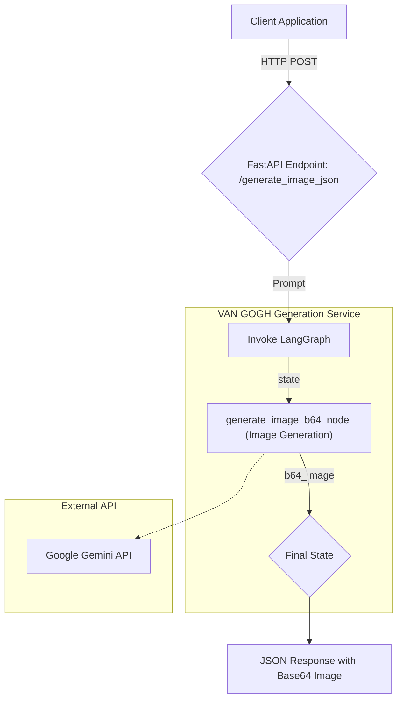
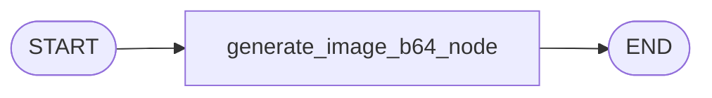

# VAN GOGH: Visual Artistic Neural Generator Of Graphics & Hues

### An Efficient Image Generation Service via Streaming

This document provides a comprehensive guide for the **VAN GOGH API**, a state-of-the-art service built with FastAPI and LangGraph. This API is designed to accept a text prompt and generate an image, which is then returned in JSON format as a Base64 string.

## Architecture 🏛️

The service architecture is simple and efficient. A client sends an HTTP POST request to a FastAPI endpoint. FastAPI then triggers a LangGraph workflow. This graph contains a single node responsible for calling the Google Gemini API via streaming to generate an image, which is then converted to Base64 format before being sent back as a JSON response.



-----

## File Structure 📁

The project is organized with a clean separation of concerns for optimal maintainability and scalability. All API keys and sensitive configurations are managed via environment variables.

```
VAN-GOGH/
├── .env.example
├── .gitignore
├── config.py
├── lang/
│   ├── graph/
│   │   └── graph.py
│   ├── node/
│   │   └── nodes.py
│   └── state/
│       └── state.py
├── logger.py
├── main.py
├── README.md
└── requirements.lock
```

-----

## LangGraph Flow Architecture 🔄

### Simple and Linear Workflow

The LangGraph workflow in this project is highly linear and efficient, designed specifically for a single task: image generation.

1.  **Entry Point**: The graph starts and immediately calls the `generate_image_b64_node`.
2.  **Image Generation**: This node receives the prompt from the state, interacts with the Google Gemini API to create an image, and encodes it to Base64.
3.  **End**: The resulting Base64 image is saved back into the state, and the workflow concludes, ready to be sent back to the client.

<!-- end list -->



### State Management

Each node in the graph processes and updates a shared `GraphState`, which tracks the input prompt and the resulting image data.

```python
# In lang/state/state.py
from typing import TypedDict

class GraphState(TypedDict):
    """
    Represents the state of a graph, including the prompt and the base64-encoded image.
    """
    prompt: str  # The text prompt for the graph
    image_b64: str  # The image in base64 encoding
```

-----

## Key Features & Benefits 🚀

### ✨ **High-Performance Generation**

  - Utilizes a streaming method when communicating with the Gemini API to capture image data as quickly as possible.
  - The asynchronous FastAPI architecture ensures efficient and responsive request handling.

### 🖼️ **JSON-Based Image Delivery**

  - Images are returned as a Base64 string within a JSON response, making them easy to integrate with various web and mobile applications.
  - Eliminates the need for temporary file storage on the server, resulting in a more stateless and scalable design.

### 🔧 **Developer-Friendly and Scalable**

  - **Easy Configuration**: Simply set the `GEMINI_API_KEY` in a `.env` file to get started.
  - **Modular**: The LangGraph structure makes it easy to add new steps in the future (e.g., prompt validation, image post-processing) without altering the core logic.
  - **Comprehensive Logging**: A configured logging system provides full visibility into every stage of the process.

-----

## Setup & Installation 🚀

Follow these steps to get the VAN GOGH API running on your local machine.

### 1\. Prerequisites

  - Python 3.10+
  - Pip (Python Package Installer)
  - A Google Gemini API Key.

### 2\. Setup Environment

1.  **Clone this repository:**

    ```bash
    git clone <repository-url>
    cd VAN-GOGH
    ```

2.  **Create and activate a virtual environment:**

    ```bash
    python -m venv venv
    source venv/bin/activate
    # On Windows: venv\Scripts\activate
    ```

3.  **Install the locked dependencies:**

    ```bash
    pip install -r requirements.lock
    ```

    *(Note: The lock file ensures consistent installations. It should be generated from your `requirements.in` or `pyproject.toml` and include packages like `fastapi`, `uvicorn`, `langgraph`, `google-generativeai`, and `python-dotenv`)*

4.  **Configure your API Key:**
    Create a file named `.env` in the root directory and add your API key.

    ```
    GEMINI_API_KEY="YOUR_GEMINI_API_KEY_HERE"
    ```

### 3\. Run the Service

Start the FastAPI server using Uvicorn:

```bash
uvicorn main:api --reload
```

The API is now live and accessible at `http://localhost:8000`.

-----

## API Reference 📖

The API provides an endpoint for image generation and a health check.

### Endpoints

  * `POST /generate_image_json`: The primary endpoint. It accepts a text prompt and returns image data in Base64 format.
  * `GET /health`: A health check endpoint to confirm the API is running.

### Request Body (`application/json`) for `POST /generate_image_json`

| Field | Type | Description | Required? |
| :--- | :--- | :--- | :---: |
| `msisdn` | `string` | The user's unique identifier (e.g., phone number). | Yes |
| `client_id` | `string` | An identifier for the client application. | Yes |
| `conversation` | `string` | The text prompt used for image generation. | Yes |
| `conversation_id`| `string` | A unique identifier for the chat message or request. | Yes |
| `timestamp` | `string` | Optional ISO format timestamp (e.g., "2025-08-25T10:45:00Z"). | No |
| `job_id` | `string` | An optional identifier for a specific job or task. | No |

### Response Body

The primary response is a detailed JSON report.

| Key | Type | Description |
| :--- | :--- | :--- |
| `chat_id` | `string` | The conversation ID from the request. |
| `client_id` | `string` | The client ID from the request. |
| `timestamp` | `string` | The timestamp when the request was processed. |
| `latency_ms` | `number` | The total processing time in milliseconds. |
| `chat` | `string` | The original prompt used for generation. |
| `msisdn` | `string` | The user ID from the request. |
| `image` | `string` | The generated image as a Base64 string. Will be `null` in case of failure. |
| `process_is_success`| `boolean`| `true` if the image generation process was successful, `false` if a system error occurred. |

### Expected Output Example

**Scenario: Successful Image Generation**

```json
{
  "chat_id": "img_req_12345",
  "client_id": "webapp_v1",
  "timestamp": "2025-09-01 10:43:14",
  "latency_ms": 3540.8,
  "chat": "A futuristic cityscape at sunset, cinematic lighting, high detail",
  "msisdn": "user_789",
  "image": "iVBORw0KGgoAAAANSUhEUgA... (long base64 string) ...Jggg==",
  "process_is_success": true
}
```

-----

## Configuration & Customization ⚙️

### 1\. Changing the AI Model

You can easily change the Gemini model used for generation by modifying the `MODEL_NAME` variable inside the `config.py` file.

```python
# In config.py
MODEL_NAME = "gemini-1.5-flash" # Or any other compatible model
```

### 2\. Adjusting Logging Level

For more detailed logs during debugging or more concise logs in production, change the `log_level` parameter in `main.py`.

```python
# In main.py
configure_logging(log_level="DEBUG", log_to_console=True) # Change "DEBUG" to "INFO", "WARNING", etc.
```